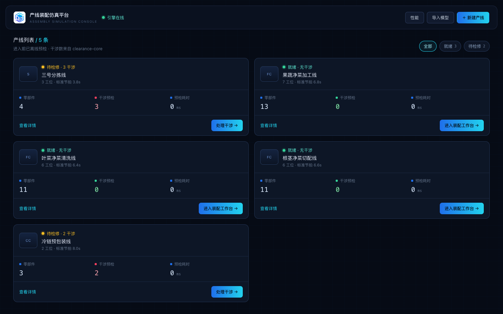
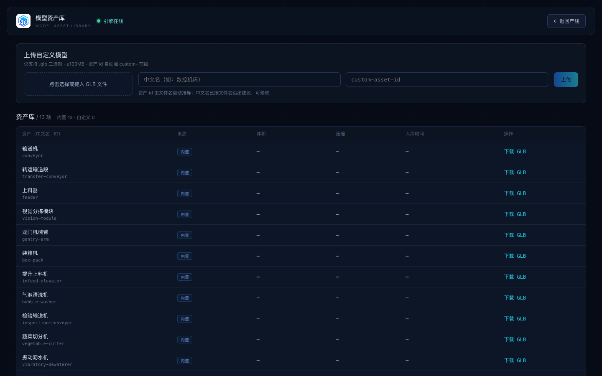
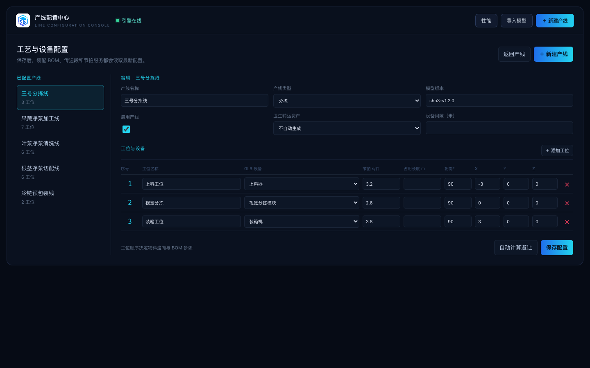
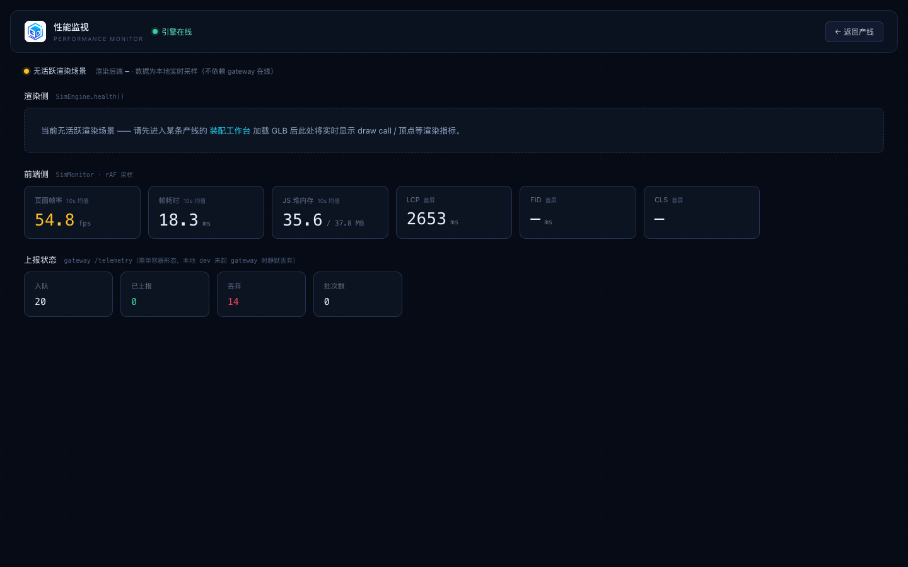
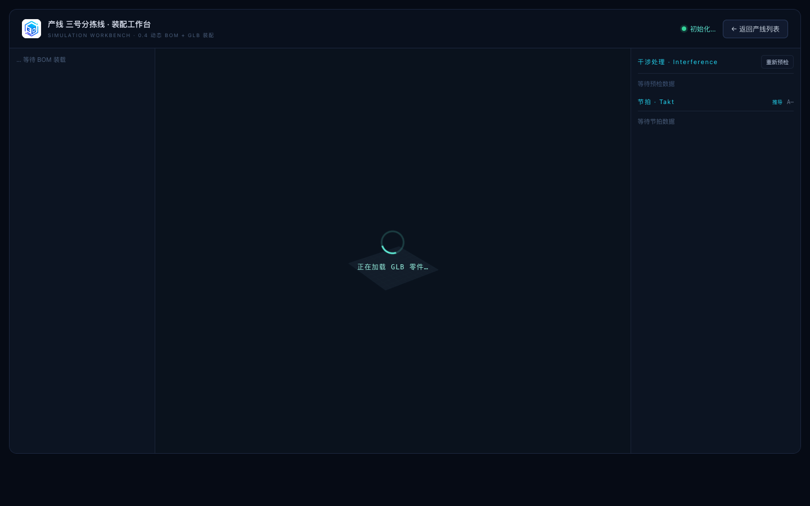
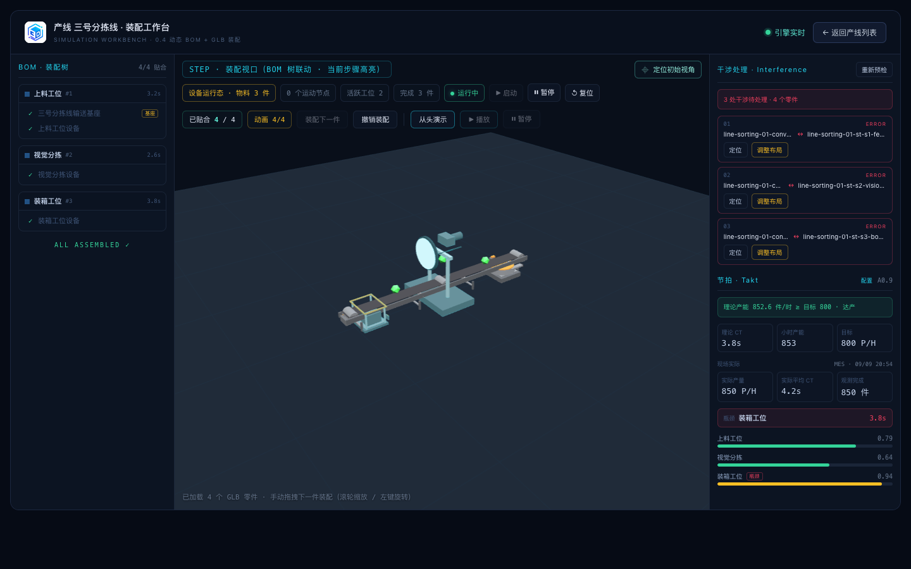

<p align="center">
  
</p>

<h1 align="center">assemble-platform · 产线 3D 装配仿真平台</h1>

<p align="center">
  工业级 Web3D 装配仿真工程 · 同一套干涉算法驱动「浏览器实时装配」与「服务端离线预检」
  <br />
  Vue 3 · TypeScript · Babylon.js · Fastify · pnpm Monorepo
</p>

---

## 项目定位

面向产线工程师与工艺规划场景的**产线 3D 装配仿真平台**：从真实产线/BOM 数据出发，在浏览器里
完成整线装配动画、手动拖拽装配与实时干涉拦截，并由服务端对整线 BOM 做离线批量预检与节拍仿真，
用于装配方案验证、干涉问题定位和产线节拍评估。

项目采用 **文档驱动 + 小步可发布**的工程哲学。架构、版本、测试与协作标准集中在 `docs/`，
工程事实源以 `docs/README.md` 为入口。

## 核心能力

| 能力 | 说明 |
| --- | --- |
| 真实数据链装配 | 工作台按 `lineId` 读取 `assembly-svc` 的 BOM，再经 `model-svc` 加载真实 GLB，不在前端合成模型 |
| 三模式仿真 | 自动装配、手动拖拽、步骤回放；约束贴合用 Slerp 平滑过渡 |
| 实时干涉 | 拖拽装配时前端调用 `clearance-core`，命中即高亮并拦截；同一算法服务端也用于离线全量预检 |
| 整线预检报告 | `interference-svc` 读真实 BOM 批量跑 `runFull()`，产线卡片展示命中数、耗时与质量指标 |
| 多产线复用 | 净菜清洗 / 切配 / 果蔬等多工艺线复用设备 GLB 资产与 BOM 排布算法 |
| 节拍仿真 | `takt-svc` 基于工位数据计算目标产能、开动率、负荷与瓶颈，前端结合现场观测展示 |
| 产线运行态 | GLB 声明驱动设备运动节点，物料沿 BOM 工位路径流转，当前工位高亮 |
| 产线配置中心 | 可视化维护工艺类型、GLB 设备、工位节拍、设备长度与卫生转运参数 |
| 可观测性 | 全链路 `X-Request-Id` 串联、`/metrics` 指标（Prometheus 文本）、gateway 结构化访问日志、前端 `SimMonitor` 埋点（Web Vitals / FPS / 内存） |

## 界面速览

<div align="center">

**v0.5 平台闭环 · 产线选择 → 模型资产 → 产线配置 → 进入工作台 → 性能监视**




<br/>




<br/>




</div>

> 工作台左侧 BOM 装配树随每一步自动联动；中栏实时 3D 装配（真实 GLB 资产），
> 右侧 3 条 ERROR 来自同套 `clearance-core` 的离线整线预检（与左侧实时点选命中共用同一算法），
> 节拍面板给出目标产能 / 当前产能 / 瓶颈工位。性能监视页实时 FPS、JS 堆内存、LCP/CLS/FID 与
> `gateway /telemetry` 上报状态，本地 dev 时「无活跃渲染场景」提示与「丢弃」计数均属设计预期。

## 关键设计

### 1. SimEngine 门面 —— 业务不直接接触 Babylon

```
Vue 业务层（views / components）
        │  只调用 SimEngine 公开接口
        ▼
SimEngine Facade（apps/sim-platform/src/engine）
        │  Scene / Asset / Interaction / Assembly / Clearance / Runtime
        ▼
@babylonjs/core（可替换引擎层，业务代码不直接 import）
```

该门面同时提供 **noop 实现**：无 WebGL 环境下仍可运行装配状态机与干涉算法，便于纯逻辑单测。

### 2. 同一套干涉算法前后端复用

`@assemble/clearance-core` 是单一算法事实源：

- **Broad Phase**：BVH 空间索引，自碰撞候选对无重复；
- **Narrow Phase**：OBB-SAT，15 分离轴短路判定，逐帧无分配；
- 交互路径走 `queryInteractive`（前端，本地零往返）；离线路径走 `loadAll + runFull`（服务端）。
- **性能门禁：200 零部件 `runFull < 200ms`**，任何几何/索引改动不得突破。

### 3. `@assemble/domain` 作为契约单一事实源

产线、BOM、装配约束、干涉报告、节拍配置/观测、模型资产与权限模型全部由 `@assemble/domain`
统一定义，apps / services / packages 共享同一类型口径，保证“前端实时判定”与“服务端离线判定”一致。

## 仓库结构

```
assemble-platform/
├─ apps/
│  ├─ sim-platform/        # 仿真工作台主应用（Vue 3 + SimEngine + Babylon）
│  └─ sim-admin/           # 管理后台（规划中）
├─ services/               # 无状态后端服务（各自含 /healthz）
│  ├─ gateway/             # 单容器聚合入口：子进程编排 + 静态托管 + 反向代理
│  ├─ assembly-svc/        # 产线 / BOM / 装配约束 / 工艺步骤（7101）
│  ├─ interference-svc/    # 服务端离线整线预检（7102）
│  ├─ model-svc/           # GLB 资产版本与下发（7103）
│  ├─ takt-svc/            # 节拍计算与瓶颈识别（7104）
│  └─ auth-svc/            # OIDC / RBAC / 审计（7105）
├─ packages/               # 前后端唯一共享层
│  ├─ domain/              # 领域类型契约（单一事实源）
│  ├─ sim-utils/           # 纯数学 / 几何工具
│  ├─ clearance-core/      # 干涉分析核心算法（BVH + OBB-SAT）
│  ├─ storage/             # 内存 / 文件降级仓储
│  ├─ http/                # 统一响应信封
│  ├─ observability/       # 轻量指标库（Counter/Histogram + Prometheus 文本 + request-id）
│  └─ security/            # 安全库（HS256 JWT + AES-256-GCM + RBAC 矩阵 + 审计哈希链）
├─ docs/                   # 架构 / 版本 / 测试 / 协作文档
├─ scripts/                # dev 编排等工程脚本
└─ Dockerfile              # CloudBase 单容器部署镜像
```

依赖方向被强制约束为：`apps / services → packages`，反向依赖、入口互相 import 均不允许。

## 技术栈

| 层 | 选型 |
| --- | --- |
| Monorepo | pnpm workspaces（`node-linker=hoisted`） |
| 前端 | Vue 3 + TypeScript + Vite + Babylon.js（经 SimEngine 门面） |
| 后端 | Node.js + Fastify，服务间走 HTTP，跨服务数据用 `@assemble/domain` |
| 测试 | Vitest；算法与纯逻辑单测；服务层集成测试；200 件性能门禁 |
| 部署 | CloudBase 云托管 + 单容器聚合镜像（gateway 监听 `80`） |

## 快速开始

### 环境要求

- Node.js ≥ 20
- pnpm 9.15.4（仓库通过 corepack 锁定）

### 安装

```bash
corepack enable
corepack prepare pnpm@9.15.4 --activate
pnpm install
```

### 一键启动开发环境

```bash
# 精简模式：assembly / interference / model / takt + Vite
pnpm dev

# 全量模式：再加 auth-svc
pnpm dev:all
```

启动脚本会自动构建缺失或过期的后端 `dist`，端口占用时自动复用。默认访问：

```text
http://localhost:5173        # sim-platform 前端
```

## 常用命令

```bash
# packages 全量（domain / sim-utils / clearance-core / storage / http）
pnpm build
pnpm typecheck
pnpm test

# 服务层测试（gateway 与 5 个后端服务）
pnpm test:services

# 单包 / 单服务迭代
pnpm --filter @assemble/clearance-core test
pnpm --filter @assemble/gateway test

# 单独启动前端 / 后端服务
pnpm dev:platform
pnpm dev:assembly
pnpm dev:interference
pnpm dev:model
pnpm dev:takt
pnpm dev:auth
```

## 质量门禁

- **任何提交**：所属包 `typecheck` + `test` 全绿；
- **merge 到 main**：全仓 typecheck + test 全绿，含性能基准；
- **clearance-core**：200 零部件 `runFull < 200ms`，不可退让；
- **契约改动**：优先向后兼容；涉及 `@assemble/domain` 必须反向全量 typecheck；
- **前端红线**：业务代码只经 SimEngine 门面，禁止直接引用 `@babylonjs/core`。

提交遵循 Conventional Commits；完整规范见 `docs/GIT_GUIDE.md` 与 `docs/CODE_STYLE.md`。

## 部署

生产部署形态为 **CloudBase 云托管单容器**：根目录 `Dockerfile` 构建全部 packages、services 与
`sim-platform` 静态产物；`gateway` 以子进程拉起 5 个上游服务，同源托管前端并前缀反代 API，
监听容器端口 `80`。推送 GitHub `main` 后由 CloudBase 自动构建发布。

详见 `docs/DEPLOYMENT.md`。

## 文档导航

`docs/README.md` 是工程文档索引，建议按场景选择：

| 想做什么 | 先读 |
| --- | --- |
| 了解业务蓝图 | `docs/产线3D装配仿真平台-工业级Web3D技术方案.md` |
| 判断版本进度 / 下一步 | `docs/VERSIONING.md` |
| 理解模块边界与架构红线 | `docs/ARCHITECTURE.md` |
| 写代码前的风格与结构 | `docs/CODE_STYLE.md` |
| 跑测试 / 了解性能门禁 | `docs/TESTING.md` |
| 提交 / 分支 / 发布 | `docs/GIT_GUIDE.md` |
| 部署 / 上线 | `docs/DEPLOYMENT.md` |
| 新增净菜设备 GLB | `docs/FRESHCUT_ASSET_SPEC.md` |

## 版本路线

版本策略与里程碑出口详见 `docs/VERSIONING.md`。当前主线处于 **M4 加固（0.5.x）**：
0.4.x（M3 平台化，v0.4.1）的多产线复用、真实 GLB 资产链路、产线配置中心与节拍观测已发布；
M4 加固已落地「测试与基准体系」与「监控与可观测性」两个方向，剩余 HA 部署编排、RBAC/审计/加密、
容灾与告警推送，之后进入 M5 试点上线。

## 协作约定

- 进入仓库写代码前先读根目录 `AGENTS.md` 与 `docs/README.md`；
- 仓库以五个本地 skill 编排「需求澄清 → 文档/契约 → 设计稿 → 小步实现 → 合并复盘」；
- `.learnings/` 是团队共享学习记录，随提交入库；
- 每个版本/里程碑分支合回 main 后保留，便于按版本归因错误与回溯 diff。
