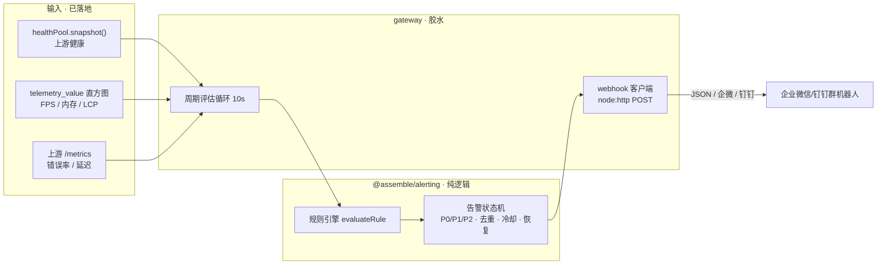

# 告警推送（ALERTING）

> **状态**：需求共识已完成，A1–A3 待实现（0.5.x M4 加固 · 容灾与告警推送方向）
> **对应方案**：`产线3D装配仿真平台-工业级Web3D技术方案.md` §8.3（告警与值班）
> **关联文档**：`OBSERVABILITY.md`（指标底座 + §5 阈值）、`HA.md`（健康池/上游健康快照）、`ARCHITECTURE.md`（模块边界）

---

## 1. 需求共识

### 目标

基于 M4「监控与可观测性」已落地的指标底座（`/metrics` 聚合 + 前端 `SimMonitor` `/telemetry` 上报 + gateway 上游健康池快照），补齐**告警闭环的代码层前置件**：阈值规则评估 → 告警状态机（分级/去重/恢复）→ 通用 webhook 推送。让异常（服务故障、性能劣化、前端卡顿/内存泄漏）能被及时推送出来，而非仅靠人肉看板。

### 范围

| 维度 | 内容 |
|------|------|
| ✅ 做 | ① 新建 `packages/alerting` 纯 TS 库：**规则引擎**（静态阈值 / 持续增长 / 健康状态三类规则）+ **告警状态机**（P0/P1/P2 分级、触发/去重/冷却/恢复）+ **webhook payload 格式化**（通用 JSON + 企业微信/钉钉群机器人可选） |
| ✅ 做 | ② gateway 周期评估循环：拉上游 `/metrics` + 读自身 telemetry 直方图 + 读健康池快照 → 评估规则 → 状态机 → webhook 推送 |
| ✅ 做 | ③ `ALERT_WEBHOOK_URL` env 配置化；未配置时只记结构化日志不推送（可观测但静默） |
| ✅ 做 | ④ `packages/alerting` 单测 + 文档同步 |
| ❌ 不做 | 不接 Prometheus Alertmanager / Grafana（轻量自研，与 OBSERVABILITY 同哲学） |
| ❌ 不做 | 不做 SLO/错误预算建模、告警聚合/关联抑制的完整实现（本期只做「去重 + 冷却」防疲劳的最小集） |
| ❌ 不做 | 不做短信/电话轮询、值班排班、IM 真人交互 |

### 输入

- **上游健康**：`healthPool.snapshot()`（S2/S3 已落地，`target.healthy`）→ 服务故障。
- **前端 telemetry**：`gatewayRegistry` 的 `telemetry_value` 直方图（`name` 标签区分 `render.fps` / `memory.js_heap_used` / `webvitals.lcp`）→ FPS<30、LCP>3s、内存增长。
- **后端 HTTP**：`fetchUpstreamMetricsText(port)` 拉取的 `http_requests_total` / `http_request_duration_seconds` → 错误率、延迟。

### 约束

- 共享逻辑放 `packages/alerting`，纯 TS **零 Node/fastify 依赖**（与 `@assemble/observability` 同哲学，浏览器/后端同源）；HTTP 推送留在 gateway 胶水层。
- 指标内存聚合、周期评估（默认 `ALERT_EVAL_INTERVAL_MS`=10s），告警也内存态（重启丢失可接受）。
- 不破「服务间不 import」红线；gateway 是唯一评估/推送点（单容器入口，天然聚合）。
- webhook 推送失败静默降级（记 warn 日志 + 进入重试/冷却），**不阻断代理主循环**。

### 核心逻辑

```
周期评估循环（gateway，默认 10s）：
  输入采集 ──► 规则评估 ──► 状态机 ──► webhook 推送
  ├─ healthPool.snapshot()      ├─ 静态阈值   ├─ P0/P1/P2 分级    ├─ 未配置 URL → 只记日志
  ├─ telemetry_value 直方图     ├─ 持续增长   ├─ active 去重      └─ 已配置 → POST JSON
  └─ 上游 /metrics 文本          └─ 健康状态   └─ 恢复通知 + 冷却
```

- **规则评估**（纯函数）：`evaluateRule(samples, rule) → { triggered, severity, value }`。
- **状态机**（纯逻辑）：`active` 状态去重（同告警持续触发不重复推送）；`recovered` 发恢复通知；冷却期 `cooldownMs` 内不重复告警。
- **推送**：webhook 客户端（gateway 内 `node:http` POST）发 `{ severity, rule, value, ts, service }`，企业微信/钉钉格式经 `formatWebhookPayload` 转换。

### 验收标准

- [ ] `packages/alerting` 规则引擎纯函数单测（静态阈值 / 持续增长 / 健康状态三类）
- [ ] 状态机单测（触发→去重→恢复→冷却，防告警疲劳）
- [ ] webhook 格式化单测（通用 JSON / 企业微信 / 钉钉三种格式）
- [ ] gateway 周期评估：本地 mock webhook server 收到触发与恢复两条 POST
- [ ] 全仓 typecheck + test 绿

**影响范围**：`packages/alerting`（新增）、`services/gateway`（评估循环 + webhook 客户端）、docs。

---

## 2. 数据流



---

## 3. 实施切片（小步可发布）

| 切片 | 内容 | 交付物 |
|------|------|--------|
| **A1** | 规则引擎 | `packages/alerting/src/rule.ts`：`AlertRule`（静态阈值/持续增长/健康状态）+ `evaluateRule` 纯函数 |
| **A2** | 告警状态机 | `packages/alerting/src/state.ts`：`AlertSeverity`（P0/P1/P2）+ 状态流转（inactive→active→recovered）+ 去重/冷却/恢复 |
| **A3** | webhook 推送 + gateway 集成 | `packages/alerting/src/webhook.ts`（payload 格式化）+ gateway 周期评估循环 + `node:http` 推送 + `ALERT_WEBHOOK_URL` |

每个切片完成即过 `typecheck` + `test`，一个逻辑单元一次 Conventional Commit。

---

## 4. 关键设计决策

| 决策 | 选择 | 理由 |
|------|------|------|
| 评估位置 | **gateway 单点** | 单容器入口，天然聚合上游指标 + telemetry + 健康快照，零新增服务 |
| 共享形态 | `packages/alerting` 纯 TS | 与 `@assemble/observability` 同哲学（无 Node 依赖、浏览器/后端同源）；HTTP 推送留 gateway |
| 推送通道 | **通用 webhook**（HTTP POST JSON） | 本地可闭环验证（mock server）；企业微信/钉钉群机器人本质都是 webhook，格式化即可适配 |
| 防告警疲劳 | 去重 + 冷却 + 恢复通知（最小集） | 技术方案 §8.3 的关联/静默/聚合属完整告警平台范畴，本期只做可验证的最小集 |
| 未配置 URL | 只记结构化日志不推送 | 开发/测试环境静默降级，不因缺 webhook 配置而报错 |
