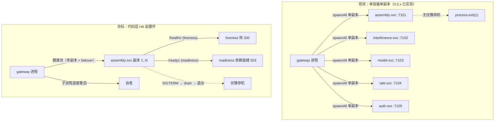

# HA —— 高可用部署与进程编排

> **状态**：S1（服务优雅停机 + readiness 分离）✅ + S2（gateway 上游健康池 + failover）✅ + S3（副本配置化 + 进程编排加固）✅ 已全部落地（0.5.x M4 加固 · HA 部署编排方向）

## 1. 需求共识

### 目标

让 assemble-platform 的「无状态后端服务 + 前端」在生产环境具备高可用所需的**代码层前置能力**：

1. 服务能**优雅停机**（`SIGTERM/SIGINT` → drain 在途请求 → 关连接 → 退出），滚动发布/扩缩容不切断请求。
2. `/healthz` 从「单一存活」升级为 **liveness / readiness 分离** + 结构化依赖状态，供编排器自愈与摘流。
3. gateway 维护**上游健康池**：多副本地址 + 健康探测 + 故障自动摘流/恢复（failover）。
4. 副本数、端口、上游地址从 **env 配置化**，不再写死 `127.0.0.1:7101–7105`。

### 范围（✅ 做 / ❌ 不做）

| ✅ 做（本地可闭环，纯代码/配置） | ❌ 不做（依赖容器/云编排，留部署层） |
|------|------|
| 各服务优雅停机（SIGTERM/SIGINT + drain + 关闭） | Docker Compose / K8s Deployment/HPA/Service 编排文件 |
| `/healthz` liveness/readiness 分离 + 依赖状态 | 真实多副本并行运行、滚动发布、自动回滚 |
| gateway 上游健康池 + failover（多地址轮询 + 摘流/恢复） | 外部 LB、服务发现（Consul/etcd）、Redis 集中会话 |
| 副本数/端口/上游地址 env 配置化 | DB 主从复制、对象存储多活、令牌吊销 |
| gateway 进程编排加固（子进程重启策略、优雅关闭传播） | 云托管容器重启策略、preStop 钩子编排 |

> **为什么这样切**：本机无 docker，容器编排层无法本地验证；而「优雅停机 + readiness + 健康池 + 配置化」是任何编排器（compose/k8s/云托管）都依赖的**代码层前置件**，本地可完整实现并单测覆盖。上层编排文件作为「部署层交付物」可后续补，但代码层先行。

### 关键设计决策

| 决策点 | 结论 | 理由 |
|------|------|------|
| 优雅停机实现 | 抽到 `@assemble/security`？不——新建共享工具，或直接在各 `server.ts` 内联 | 停机逻辑与 Fastify 实例强相关，且各服务 `server.ts` 极薄（~15 行），内联 + 一个共享 helper 最简 |
| liveness vs readiness | `GET /healthz` 返回 liveness（进程活着）；`GET /readyz` 返回 readiness（依赖就绪可接流量） | 编排器标准双探针；liveness 恒 200（活着即 true），readiness 依赖降级仓储/上游才 503 |
| 健康池形态 | gateway 内维护 `Map<service, UpstreamTarget[]>`，支持一服务多地址；探测失败摘流、定时恢复 | 单容器内已能表达「多副本 + failover」，无需外部服务发现 |
| 副本配置来源 | env：`SVC_REPLICAS` / `UPSTREAM_TARGETS`（逗号分隔 host:port） | 保持与现有 `PORT`/`HOST` env 风格一致 |
| 网关子进程重启 | 上游子进程异常退出 → 记录 + 指数退避重启（而非 `process.exit(1)` 整体崩溃） | 单机自愈；整体崩溃留给容器重启 |

### 验收标准

- [x] 各服务 `SIGTERM` 后：停止接新连接 → drain 在途（默认 3s）→ 退出，`/readyz` 先返回 503
- [x] `/healthz`（liveness）恒 200；`/readyz`（readiness）依赖不健康时 503
- [x] gateway 上游健康池：某副本故障 → 该地址摘流、请求自动 failover 到健康副本；恢复后重新入池
- [x] 副本数/端口/上游地址均 env 可配，缺省回退当前单副本 `127.0.0.1:7101–7105`
- [x] gateway 子进程异常退出不再整体 `process.exit(1)`，而是退避重启
- [x] 全仓 typecheck + test 绿

## 2. 鉴权/部署数据流（现状 → 目标）

## 3. 切片计划

| 切片 | 内容 | 状态 |
|------|------|------|
| **S1** | 服务优雅停机 + readiness 分离 | ✅ 已落地 |
| **S2** | gateway 上游健康池 + failover | ✅ 已落地 |
| **S3** | 副本配置化 + 进程编排加固 | ✅ 已落地 |

### S1 详情

- 5 个服务的 `server.ts`：新增 `SIGTERM/SIGINT` 处理器 → `app.close()` 前先置 readiness 为 down（`/readyz` 返回 503）→ drain（默认 `GRACEFUL_SHUTDOWN_TIMEOUT_MS`=3000）→ 退出。
- `app.ts`：`/healthz`（liveness，恒 200）+ `/readyz`（readiness，含依赖状态）。
- 共享 helper 落 `packages/health`（新 workspace 包）：`registerHealthRoutes`（双探针路由）+ `createReadinessState` + `installGracefulShutdown` + `httpUpstreamProbe`（依赖可达性探针）；通过 `app.decorate('readinessState', ...)` + fastify 类型增强暴露给 `server.ts`。
- interference-svc / takt-svc 依赖 assembly-svc：`/readyz` 用 `httpUpstreamProbe(`${assemblyBaseUrl}/healthz`)` 探活，上游不可达返回 503；assembly/model/auth 无外部依赖，readiness 恒就绪（仅优雅停机时转 not_ready）。

### S2 详情

- gateway 内新增 `healthPool.ts`：`UpstreamHealthPool`（`add`/`pick` 轮询选址 /`markUnhealthy` 摘流 /`refresh` 恢复 /`snapshot` 快照），探针通过构造注入（纯逻辑，6 单测覆盖轮询、摘流、恢复、快照）。
- `server.ts` 转发改为「健康池选地址 + 失败 failover 重试一次」：请求体缓冲（≤5MB）支持重放；首次连接失败 → 摘流 → 再 pick 重试一次；无健康副本返回 502。
- `/healthz` 聚合改为读健康池快照（`service/host/port/ready`）；启动 `waitForUpstreams` 走 `pool.refresh()`；周期探活（默认 5s）让恢复的上游自动重新入池。
- 多副本地址（≥2 目标才有真正的跨副本 failover）由 S3 的 `UPSTREAM_TARGETS` env 提供。

### S3 详情

- `routing.ts` 新增 `parseUpstreamTargets`（解析 `UPSTREAM_TARGETS` 逗号分隔 `service=host:port,...`，非法条目静默跳过）+ `resolveUpstreams`（显式配置原样使用、`spawnLocal=false`；缺省回退单副本 `127.0.0.1:7101–7105`、`spawnLocal=true`）。
- 新增 `supervisor.ts` `UpstreamSupervisor`：spawn 本地子进程 + 异常退出**指数退避重启**（`backoffDelayMs` 纯函数：base 500ms、封顶 15s、上限 10 次）替代 `process.exit(1)` 整体崩溃；`stopAll()` 优雅关闭传播（停止重启 + SIGTERM 存活子进程）。
- `server.ts`：健康池目标改由 `resolveUpstreams` 驱动（多副本/外部地址可配）；显式配置外部上游时不 spawn、纯反代；新增 `installGatewayShutdown`（SIGTERM/SIGINT → 关代理 → SIGTERM 子进程 → 退出，超时兜底 5s）。
- 单测：`routing.test.ts` 补 `parseUpstreamTargets`/`resolveUpstreams` 用例、新增 `supervisor.test.ts`（退避曲线、重启、超限放弃、stopAll、spawn 抛错重试）。
