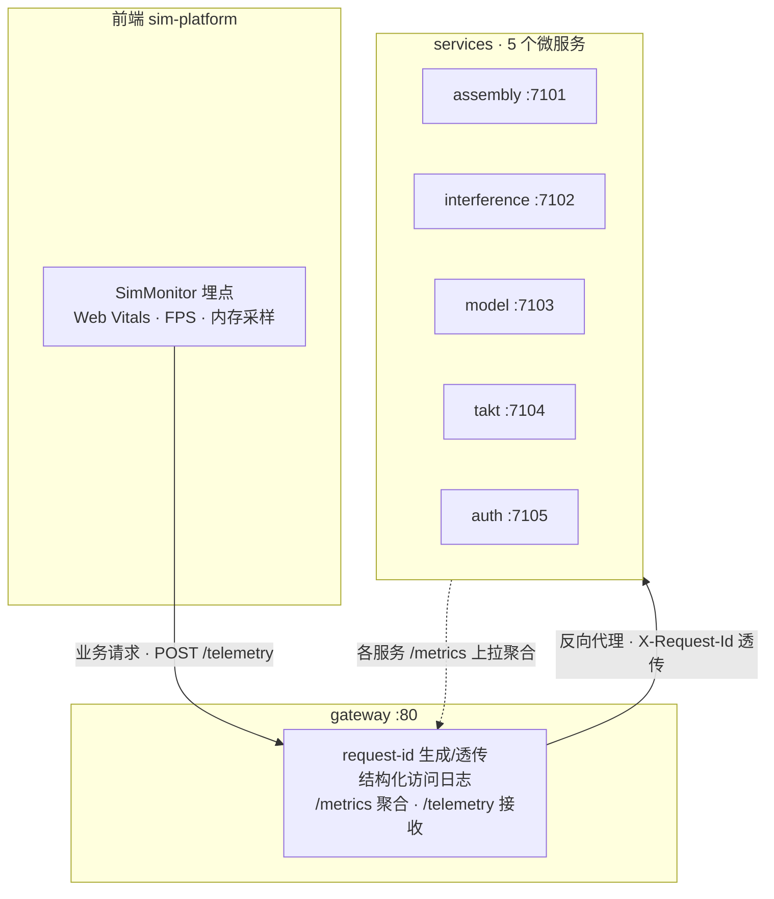

# 监控与可观测性（OBSERVABILITY）

> **状态**：M1（指标库 + request-id + `/metrics`）与 M2（gateway 改造）已落地；M3（前端 SimMonitor）待实现（0.5.x M4 加固 · 监控告警方向）
> **对应方案**：`产线3D装配仿真平台-工业级Web3D技术方案.md` §8
> **关联文档**：`ARCHITECTURE.md`（模块边界）、`TESTING.md`（门禁）、`VERSIONING.md`（版本档）

---

## 1. 需求共识

**目标**：补齐平台的轻量可观测性三件套——用 `request-id` 串起跨服务日志、`/metrics` 输出核心指标、gateway 结构化访问日志；前端落地 `SimMonitor` 埋点（Web Vitals / FPS / 内存）上报，让系统可观测、可定位问题。

**范围**

| 维度 | 内容 |
|------|------|
| ✅ 做 | ① 新建 `packages/observability` 纯 TS 指标库（Counter/Histogram + Prometheus 文本序列化），**零 Node/fastify 依赖**（浏览器/后端同源） |
| ✅ 做 | ② 5 个后端服务接入 `/metrics` + request-id（响应头 `X-Request-Id` + 跨服务调用透传） |
| ✅ 做 | ③ gateway 改造：`console.log` → 结构化 JSON 日志、request-id 透传/生成、`/metrics` 聚合 5 上游、新增 `/telemetry` 端点 |
| ✅ 做 | ④ 前端 `SimMonitor` SDK：Web Vitals + FPS + 内存采样，节流批量上报 `/telemetry` |
| ✅ 做 | ⑤ 文档同步 + `packages/observability` 单测 |
| ❌ 不做 | 不引 Prometheus/Grafana/Loki/OpenTelemetry |
| ❌ 不做 | 不做 IM/短信/电话告警推送（预留阈值常量，接入留 HA 方向） |
| ❌ 不做 | 不做 OTel 链路 span 采样 |
| ❌ 不做 | 不做 DB/Redis 水位（当前无这些组件） |

**输入**：HTTP 请求（Fastify hook）、前端 Performance API + requestAnimationFrame。

**约束**

- 共享逻辑放 `packages/`，不破「服务间不 import」架构红线。
- `packages/observability` 保持无 Node/fastify 依赖（浏览器/后端同源可用）。
- 指标内存聚合（重启丢失可接受，指标本就临时）。
- 前端上报走 gateway `/telemetry` 同源路径，免跨域。

**核心逻辑**

- 每请求：`onRequest` 记开始时间与 reqId → `onResponse` 累计 counter + histogram 并写 `X-Request-Id` 响应头。
- 跨服务调用（interference→assembly、takt→assembly）透传 `X-Request-Id`，使日志串成一条链路。
- 前端 `SimMonitor` 用 `requestAnimationFrame` 计 FPS、`PerformanceObserver` 采 Web Vitals、`performance.memory` 采内存，节流批量 POST `/telemetry`。
- gateway `/telemetry` 接收上报 → 结构化日志 + 内存聚合。

**验收标准**

- [ ] `curl` 任一服务 `/metrics` 返回 Prometheus 文本，含 `http_requests_total`、`http_request_duration_seconds`
- [ ] 响应头含 `X-Request-Id`，跨服务调用日志里 request-id 一致
- [ ] gateway `/metrics` 聚合 5 上游指标
- [ ] 前端打开工作台，`SimMonitor` 上报 FPS/LCP 等，`/telemetry` 收到
- [ ] 全仓 typecheck + test 绿，`packages/observability` 有单测

**影响范围**：`packages/observability`（新增）、5 个 services、gateway、apps/sim-platform、docs。

---

## 2. 数据流

三条链路对应本期的核心动作：

1. **下行主链路**（实线）：前端业务请求 + `SimMonitor` 上报 → gateway（同源）。
2. **反向代理**（实线）：gateway 透传 `X-Request-Id` 到各服务，日志串成一条。
3. **指标回流**（虚线）：gateway 上拉 5 个服务的 `/metrics` 合并成一份聚合指标。

---

## 3. 实施切片（小步可发布）

| 切片 | 内容 | 交付物 | 状态 |
|------|------|--------|------|
| **M1** | 指标库 + request-id + /metrics | `packages/observability`（Counter/Histogram + Prometheus 序列化）；5 服务接入 `/metrics` 与 `X-Request-Id` 透传 | ✅ 已落地 |
| **M2** | gateway 改造 | 结构化 JSON 日志；request-id 透传/生成；`/metrics` 聚合 5 上游；`/telemetry` 端点 | ✅ 已落地 |
| **M3** | 前端 SimMonitor | Web Vitals + FPS + 内存采样，节流批量上报 `/telemetry` | ⬜ 待实现 |

每个切片完成即过 `typecheck` + `test`，一个逻辑单元一次 Conventional Commit。

---

## 4. 关键设计决策

| 决策 | 选择 | 理由 |
|------|------|------|
| 落地深度 | **轻量自研**（不引 Prometheus/OTel 等外部组件） | 当前 CloudBase 单容器无外部组件可接；自研 `/metrics`（Prometheus 文本格式）可被 `curl` 直看，未来接 Prometheus 无缝迁移 |
| telemetry 落点 | **gateway `/telemetry`** | 单容器入口、同源免跨域、零新增服务 |
| 指标存储 | **内存聚合**（不落盘） | 指标本就临时，重启丢失可接受 |
| 共享位置 | `packages/observability` 纯 TS | 遵守「共享逻辑进 packages、服务间不 import」红线；无 Node/fastify 依赖使浏览器/后端同源 |
| 跨服务链路 | 透传 `X-Request-Id` 头 | 复用 Fastify 原生 reqId，不改消息契约 |

---

## 5. 告警阈值（预留，本期不接）

技术方案 §8.2 定义的仿真专项指标阈值，本期只埋点采集，不接告警推送（接入留 HA 方向）：

| 类别 | 指标 | 阈值/告警 |
|------|------|----------|
| 加载性能 | glTF 下载体积、解码时长、首帧、场景就绪 | 加载 >3s 告警 |
| 渲染性能 | FPS、draw call、每帧 CPU/GPU 时间 | FPS<30 采样告警 |
| 内存 | JS 堆内存、显存估算、资源泄漏增长曲线 | 持续增长触发泄漏排查 |
| 业务指标 | 干涉检测耗时（P95）、节拍仿真成功率 | 干涉 >200ms P95 预警 |
| 前端体验 | LCP/FID、Web Vitals | 异常时告警 |
