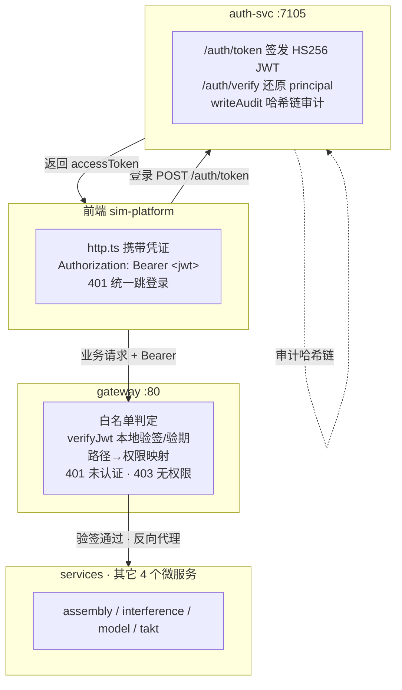

# 安全、鉴权、审计与加密（SECURITY）

> **状态**：S1（安全共享库）✅、S2（auth-svc 真实签发 + 审计加固）✅ 已落地；S3（网关鉴权 + 前端凭证）待实现（0.5.x M4 加固 · 安全方向）
> **对应方案**：`产线3D装配仿真平台-工业级Web3D技术方案.md` §7（安全、鉴权、数据与容灾）
> **关联文档**：`ARCHITECTURE.md`（模块边界）、`OBSERVABILITY.md`（request-id 链路）、`TESTING.md`（门禁）、`VERSIONING.md`（版本档）

---

## 1. 需求共识

**目标**：把平台从「演示级鉴权」（无签名假 JWT、网关不校验凭证）提升为「可自证安全的轻量闭环」——用 `packages/security` 提供真实 JWT 签发/验证与字段加密，`auth-svc` 做真实签发与不可变审计，`gateway` 统一鉴权，前端携带凭证。

**范围**

| 维度 | 内容 |
|------|------|
| ✅ 做 | ① 新建 `packages/security` 纯 TS 安全库（HS256 JWT + AES-256-GCM 字段加密 + scrypt 派生 + 常量时间比较 + RBAC 矩阵 + 审计哈希链），**零外部依赖**（只用 `node:crypto`） |
| ✅ 做 | ② RBAC 角色→权限矩阵从 `auth-svc/src/rbac.ts` 迁入 `packages/security`，作为**授权单一事实源**（gateway/auth-svc 同源） |
| ✅ 做 | ③ `auth-svc` `/auth/token` 改为真实 HS256 JWT 签发（`AUTH_JWT_SECRET`，缺省开发密钥 + 生产告警）；新增 `/auth/verify` |
| ✅ 做 | ④ 审计覆盖 auth-svc 全部敏感操作 + `/audit` 列表查询 + **append-only 哈希链**防篡改 |
| ✅ 做 | ⑤ `gateway` 本地 `verifyJwt` + 路径→权限映射鉴权（401 未认证 / 403 无权限），白名单放行健康探针/指标/telemetry/auth 登录与静态资源 |
| ✅ 做 | ⑥ 前端 `http.ts` 支持注入凭证 + 401 统一处理 |
| ✅ 做 | ⑦ 文档同步 + `packages/security` 单测 |
| ❌ 不做 | 不接真实 OIDC/OAuth2 IdP（无企业账号体系可接，SSO 留接入点） |
| ❌ 不做 | 不引 Redis 集中会话 / 令牌吊销列表（短效无状态 JWT 覆盖，吊销留 HA 方向） |
| ❌ 不做 | 不做 mTLS / 服务间 TLS（单容器内 loopback，TLS 由 CloudBase 层承担） |
| ❌ 不做 | 不做 glTF CDN 签名 URL、DB/对象存储静态加密（当前无 DB/对象存储组件） |

**输入**：登录请求（`/auth/token`）、携带 `Authorization: Bearer <jwt>` 的业务请求、敏感字段明文。

**约束**

- 共享逻辑放 `packages/`，不破「服务间不 import」架构红线；授权矩阵单一事实源。
- `packages/security` 只依赖 `node:crypto`（Node-only，网关/auth-svc 同源；浏览器只存与发 token，不做密码学）。
- JWT 用无状态短效（`exp` 默认 1h），密钥经 `AUTH_JWT_SECRET` 注入；生产未显式配置时**拒绝以默认密钥签发**（仅开发告警可用）。
- 审计 append-only + 哈希链：新增条目 `hash = SHA256(prevHash + canonical(entry))`，可全链校验篡改。

**核心逻辑**

- 登录：前端 `POST /auth/token {userId, role}` → auth-svc 校验 → 用 `AUTH_JWT_SECRET` 签 HS256 JWT → 返回 `{ accessToken, tokenType, expiresIn }`，并写审计 `token.issue`。
- 鉴权：网关对非白名单路径解析 `Authorization: Bearer` → 本地 `verifyJwt` 验签/验期 → 解析 principal → 路径→权限断言 → 不通过回 401/403。
- 审计：auth-svc 对 `token.issue` / `token.verify` / `authorize` 等敏感操作 `writeAudit`，条目带哈希链；`/audit` 支持按 actorId/action 过滤查询与全链校验。

**验收标准**

- [x] `packages/security` 单测全绿；JWT 篡改/过期必被拒，字段加解密往返一致，常量时间比较通过
- [x] `POST /auth/token` 返回真实可验签的 JWT；`/auth/verify` 能还原 principal
- [x] 无凭证访问受保护 API → 401；凭证权限不足 → 403；白名单路径可匿名访问
- [x] 审计链 `verifyAuditChain` 全绿；篡改任一条目 → 校验失败
- [x] 全仓 typecheck + test 绿

**影响范围**：`packages/security`（新增）、`services/auth-svc`、`services/gateway`、`apps/sim-platform`（http.ts）、`packages/domain`（`AuditLogEntry` 增可选哈希字段，向后兼容）、docs。

---

## 2. 数据流

三条链路对应本期核心动作：

1. **登录发签**（实线）：前端换 token → auth-svc 真实签发 JWT + 写审计。
2. **网关鉴权**（实线）：网关本地验签 + 权限断言，通过才转发到业务服务。
3. **审计闭环**（虚线）：auth-svc 敏感操作全部入 append-only 哈希链，可追溯、可校验。

---

## 3. 实施切片（小步可发布）

| 切片 | 内容 | 交付物 | 状态 |
|------|------|--------|------|
| **S1** | 安全共享库 | `packages/security`（jwt / crypto / rbac / audit）+ 单测 | ✅ 已落地 |
| **S2** | auth-svc 真实签发 + 审计加固 | `/auth/token` 真实 JWT、`/auth/verify`、审计全覆盖 + `/audit` 列表 + 哈希链 | ✅ 已落地 |
| **S3** | 网关鉴权 + 前端凭证 | gateway `verifyJwt` + 路径权限映射（401/403）+ 白名单；前端 http.ts 凭证与 401 处理 | ✅ 已落地 |

每个切片完成即过 `typecheck` + `test`，一个逻辑单元一次 Conventional Commit。

---

## 4. 关键设计决策

| 决策 | 选择 | 理由 |
|------|------|------|
| 落地深度 | **轻量自研**（不引 jose/passport/OIDC IdP） | 与「监控可观测性」方向口径一致：无企业 IdP 可接，`node:crypto` 即可自证安全，未来接 OIDC 时签发/验证接口不变 |
| 签名算法 | **HS256**（对称 HMAC） | 单容器、密钥经 env 注入即可；切 RS256（OIDC）时仅换 `signJwt/verifyJwt` 实现 |
| 鉴权位置 | **网关本地 verifyJwt** | 单容器同 env 共享 `AUTH_JWT_SECRET`，避免每请求打到 auth-svc；auth-svc 仍是签发唯一事实源 |
| RBAC 单一事实源 | 矩阵迁入 `packages/security` | 网关与 auth-svc 同源，杜绝两处矩阵漂移 |
| 令牌形态 | 无状态短效 JWT（`exp` 1h） | 无 Redis 可依赖；吊销/踢出留 HA 方向 |
| 审计防篡改 | append-only + 哈希链（SHA-256） | 纯内存/文件即可自证不可变，不引外部账本 |
| 密钥治理 | `AUTH_JWT_SECRET` env；生产缺省拒绝签发 | 避免硬编码密钥入仓；开发降级有显式告警 |

---

## 5. 安全边界与预留（本期不接）

技术方案 §7 定义的完整安全能力，本期只落地「鉴权 + RBAC + 审计 + 字段加密」轻量闭环，以下留接入点：

| 类别 | 内容 | 状态 |
|------|------|------|
| 认证 | 企业 OIDC/OAuth2 SSO、MFA | 留 `verifyJwt` 算法切换点（HS256→RS256） |
| 会话 | Redis 集中会话、令牌吊销/踢出 | 无状态 JWT 覆盖；吊销留 HA |
| 传输 | 服务间 mTLS、TLS 终结 | CloudBase 层承担 |
| 静态加密 | DB / 对象存储 / glTF 版权（CDN 签名 URL） | 当前无 DB/对象存储组件 |
| 输入校验 | glTF 上传魔数/体积/路径穿越防护 | 资产管线预留（见 `FRESHCUT_ASSET_SPEC.md`） |
| 供应链 | SBOM + 镜像漏洞扫描 | CI 加固方向 |
