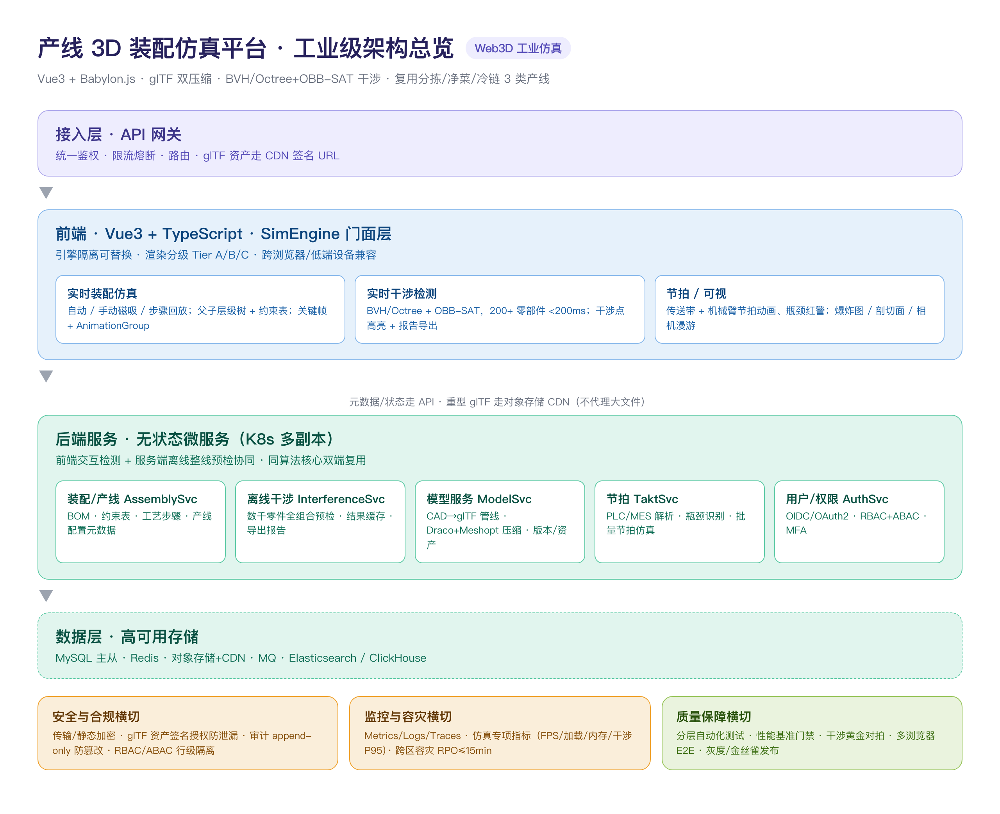

# 产线 3D 装配仿真平台 · 工业级 Web3D 技术方案

> **文档定位**：面向"社区生鲜中央仓/分拣/净菜/冷链"产线装配仿真的工业级工程方案，从场景理解、技术选型到部署上线的完整落地路径，可直接用于生产环境实施，也可作为项目技术评审的支撑材料。
>
> **配套简历口径**：`Vue3 + TypeScript + Babylon.js` · `gITF/GLB + Draco + Meshopt 双压缩（12MB→3MB，-75%）` · `BVH/Octree + OBB-SAT 干涉分析（<200ms）` · `自动/手动/步骤回放装配` · `关键帧动画 + AnimationGroup` · 复用 `分拣 / 净菜 / 冷链` 3 类产线，新产线建模到上线 ↓50%。

---

## 目录

1. [业务场景与典型使用对象](#1-业务场景与典型使用对象)
2. [完整实施路径：从场景理解到部署上线](#2-完整实施路径从场景理解到部署上线)
3. [技术栈选型与选择理由](#3-技术栈选型与选择理由)
   - 3.1 Web3D 渲染方案
   - 3.2 前端框架与工程化
   - 3.3 后端服务与数据交互
4. [核心功能模块设计](#4-核心功能模块设计)
5. [性能优化策略](#5-性能优化策略)
   - 5.1 实时渲染性能
   - 5.2 大场景与海量模型加载
   - 5.3 内存与资源管理
   - 5.4 跨浏览器与低端设备兼容
6. [工业级架构设计](#6-工业级架构设计)
7. [安全、鉴权、数据与容灾](#7-安全鉴权数据与容灾)
8. [监控与可观测性](#8-监控与可观测性)
9. [质量控制与验证方案](#9-质量控制与验证方案)
10. [实施里程碑与上线清单](#10-实施里程碑与上线清单)
11. [风险清单与应对](#11-风险清单与应对)

---

## 1. 业务场景与典型使用对象

### 1.1 业务背景

钱大妈是社区生鲜连锁企业，供应链核心在**中央仓 + 前置分拣/净菜/冷链产线**。产线由大量自动化设备（传送带、机械臂、分拣机器人、净菜处理机、冷链输送线）按特定工艺节拍装配组成。投产前面临三个痛点：

- **工艺验证难**：产线改造/新线投产前，若直接物理搭建验证，成本高、周期长、返工风险大。
- **干涉与瓶颈不可见**：设备间是否存在空间干涉、产线节拍是否匹配（瓶颈工位），缺乏数字化预演手段。
- **培训依赖实物**：新人装配/维护培训需在真机上操作，占用产线、有安全风险。

### 1.2 平台要解决的核心命题

| 命题 | 说明 | 对应简历能力 |
|------|------|--------------|
| **装得上** | 产线设备能否按工艺顺序在 3D 空间无干涉装配到位 | 装配仿真 / 干涉分析 |
| **动得顺** | 产线整线节拍是否流畅、是否存在瓶颈工位 | 节拍仿真 / 传送带+机械臂动画 |
| **看得清** | 装配内部结构、装配顺序、维护步骤可视化 | 爆炸图 / 剖切面 / 步骤回放 |
| **跑得快** | 产线模型动辄数百零部件，低端设备也要流畅 | 模型轻量化 / 性能优化 |

### 1.3 典型使用对象（Persona）

| 角色 | 使用场景 | 核心诉求 | 关注指标 |
|------|----------|----------|----------|
| **产线/工艺工程师** | 新线或改造产线的**装配工艺验证** | 提前发现干涉、验证装配顺序 | 干涉检出率、验证周期 |
| **仿真工程师** | 产线**节拍仿真与瓶颈分析** | 定位瓶颈工位、优化节拍 | 节拍准确性、瓶颈定位速度 |
| **装配/维护培训生** | **装配步骤培训与考核** | 安全、直观、可反复练习 | 培训时长、考核通过率 |
| **工厂管理者** | 查看**产线数字化演示与汇报** | 直观演示整线运行状态 | 可视化完整度、真实感 |
| **产线改造项目组** | 一条**新产线的从建模到上线** | 快速复用已有产线/设备资产 | 建模到上线周期 ↓50% |

### 1.4 三类产线的差异化侧重

| 产线类型 | 特点 | 技术侧重 |
|----------|------|----------|
| **分拣产线** | 高速节拍、多机械臂、输送分拣 | **节拍瓶颈**仿真、大量 InstancedMesh（料箱） |
| **净菜产线** | 工序多、装配顺序复杂、刀具/工装干涉 | **装配干涉**检测、步骤回放、爆炸图 |
| **冷链产线** | 设备多、规模大、环境低温、输送线长 | **大规模模型**加载与 LOD、内存管理 |

> ⚠️ **架构决策**：平台做**产线级抽象**而非"产线专用"。所有能力（SimEngine、模型管线、装配、干涉、节拍）与"某条产线"解耦，通过**产线配置元数据**（设备清单、BOM、节拍参数、工艺步骤）驱动 → 支撑"3 类产线复用 + 新线快速上线"这一核心 KPI。

---

## 2. 完整实施路径：从场景理解到部署上线

采用**瀑布式主线 + 迭代式交付**：先建可运行 MVP 验证核心算法，再横向扩展产线类型，最后强化工业级非功能能力。

```
Phase 0 ─ 场景理解 ─────── 业务痛点访谈 / 3类产线现场调研 / 现有CAD与PLC/MES资料盘点
        │
Phase 1 ─ 技术验证(Sprint 1-2)
        │   · 引擎选型 PoC（Babylon vs Three，碰撞/约束/glTF负载实测）
        │   · 模型管线打通：CAD → glTF → Draco+Meshopt 压到可接受体积
        │   · 装配约束 + 干涉分析核心算法验证（BVH/Octree + OBB-SAT）
        │   · 输出：MVP 一条产线单设备装配可跑、干涉可检出
        │
Phase 2 ─ MVP 建设(Sprint 3-6)  【第一条产线：净菜 或 分拣】
        │   · SimEngine 引擎封装、Vue3 应用骨架、装配3模式
        │   · 节拍仿真初版、爆炸图/剖切
        │   · 后端：模型服务 + 装配数据 + 基础鉴权
        │
Phase 3 ─ 平台化与横向扩展(Sprint 7-12)
        │   · 产线配置元数据驱动 → 抽象出"产线模板"
        │   · 接入第 2、3 类产线，验证差异化侧重
        │   · 模型资产库：设备/料箱等可复用资产沉淀
        │   · 性能：LOD/实例化/资源池落地
        │
Phase 4 ─ 工业级加固(Sprint 13-18)
        │   · 高可用部署、鉴权/RBAC、审计、容灾、监控告警
        │   · 自动化测试 + 性能基准 + 回归体系
        │   · 权限隔离、数据加密、供应链安全
        │
Phase 5 ─ 试点与上线
        │   · 选一条真产线项目组灰度试点 → 收集反馈
        │   · 新产线项目以平台承接 → 验证"建模到上线 ↓50%"
        │
Phase 6 ─ 持续运营
            · 新产线模板沉淀、性能监控看板、A/B 迭代
```

**关键里程碑 Gate**：每 Phase 结束设技术评审 Gate（含非功能验收：性能基线、可用性、安全扫描），不达标不放行下一阶段。

---

## 3. 技术栈选型与选择理由

### 3.1 Web3D 渲染方案：Babylon.js（WebGL2 优先）

| 维度 | 选择 | 理由 |
|------|------|------|
| 渲染引擎 | **Babylon.js 6.x** | 见下方详细论证 |
| 底层 | WebGL2（移动/低端设备降级 WebGL1） | 无需 WebGPU 兼容面即可覆盖企业存量设备 |
| 格式 | **glTF/GLB 2.0** 为唯一源模型标准 | 工业 CAD 转换的开放事实标准，跨工具生态（Blender/3ds Max/SolidWorks 转换链） |

**为什么选 Babylon.js 而非 Three.js（本场景核心决策）：**

1. **装配仿真对碰撞/约束是刚需** → Babylon 内置 `ActionManager`、`PhysicsEngine`、父子层级树、约束处理，装配吸附/碰撞开箱即用；Three.js 多需自封装。
2. **重工程、重类型** → Babylon 是**强类型 TS 原生**引擎，类型提示/IDE 完善，多人协作（本项目跨前端/仿真/建模多角色）不易出错。
3. **企业级工程与调试** → 官方 `Scene Inspector` 运行时调试面板，可现场检视场景树/材质/性能，大幅降低大型场景排障成本。
4. **glTF/动画/材质管线完备** → PBR、IBL、AnimationGroup、LOD 均内置。

> ⚠️ **选型边界（自洽口径）**：并非 Three.js 不好。Three.js **生态更大、更灵活、更轻**，适合轻量定制与纯展示场景。本项目**重约束、重碰撞、重工程排障**，所以选 Babylon。团队保留 Three.js 能力以覆盖差异化项目。

**架构决策——不裸用 Babylon，封装 `SimEngine`：**
> 简历已写 `SimEngine 引擎`（Scene/Engine/Inspector 解耦、HMR、Inspector 调试面板）。这是**关键工程决策**：所有业务代码不直接 touch Babylon API，而是通过 SimEngine 的门面接口。目的：**把引擎层隔离出来**——未来可横向替换/升级引擎（含切 Three.js）而不动业务，也便于单测（可注入 mock engine）。

```
┌────────────────────────────┐
│  Vue3 业务组件层（只依赖 SimEngine 接口）  │
└──────────────┬─────────────┘
        SimEngine Facade
  ┌────────────┼────────────┐
 SceneManager  AssetManager  InteractionMgr
  │   │   │        │             │
  │  Camera      glTF/PBR    装配/干涉/节拍
  │   │   │        │             │
  └─── Babylon.js Runtime（可替换层）───┘
```

### 3.2 前端框架与工程化：Vue3 + TypeScript + Vite

| 项 | 选择 | 理由 |
|----|------|------|
| 框架 | **Vue3（Composition API）** | 团队既有 Vue 技术栈、迁移成本低；`<script setup>` 组织大型仿真页面逻辑清晰 |
| 语言 | **TypeScript** | 与 Babylon TS 原生契合；多角色协作下的可维护性（简历 8年经验核心卖点之一） |
| 构建 | **Vite** | 启动/HMR 快，SimEngine 分包优化；Babylon 体积大，Vite 的代码分割控制更细 |
| 状态管理 | Pinia | 场景运行时状态（当前装配步骤、选中零件、相机状态）与 UI 状态分离 |
| 样式 | Tailwind / Element Plus | 后台管理型界面用 Element Plus，仿真控制面板自定义 |
| 包管理 | pnpm | 严格依赖 + 多包 workspace 支持（SimEngine 可独立为内部包） |

**代码组织（Monorepo，pnpm workspace）：**

```
apps/
  sim-platform     # 主应用（Vue3）—— 仿真工作台
  sim-admin        # 管理后台（产线/模型/用户/权限配置）
packages/
  sim-engine       # SimEngine（Babylon 封装，核心，独立可测）
  sim-model-pipe   # 模型管线 CLI/服务端（CAD→glTF→压缩）
  sim-asset-lib    # 可复用产线资产库（设备/料箱/工装 glTF）
  ui-lib           # 业务组件库（结合简历：自研组件库能力）
  sim-utils        # 共享工具（坐标/矩阵/节拍计算）
```

### 3.3 后端服务与数据交互

采用**微服务 + 网关**，核心服务与职责：

| 服务 | 技术栈 | 职责 | 数据 |
|------|--------|------|------|
| **API 网关** | Kong/Higress（简历有 Higress AI 网关经验，口径一致） | 统一入口、鉴权、限流、路由 | - |
| **模型服务 ModelSvc** | Go / Node | glTF 元数据、模型下载/CDN 签名、Draco/Meshopt 压缩任务队列、资产版本 | 对象存储（glTF 文件）|
| **装配服务 AssemblySvc** | Node.js（NestJS） | 产线/BOM/装配约束表/工艺步骤 CRUD | MySQL |
| **节拍仿真服务 TaktSvc** | Python (FastAPI，简历技术栈) | 节拍计算/瓶颈分析（服务端可跑离线批量仿真） | MySQL/Redis |
| **干涉分析服务 InterferenceSvc** | Python/Go | 服务端**批量/离线**大场景干涉预检（浏览器端做实时交互检测，服务端做整线全量校验） | 结果缓存 |
| **用户/权限服务 AuthSvc** | Node | 统一认证（OIDC）、RBAC/ABAC | MySQL/Redis |
| **审计/日志服务** | 采集 + Elasticsearch/ClickHouse | 操作审计、运行日志、指标 | ES/ClickHouse |
| **AI（可选增强）** | Python | 节拍异常告警、装配步骤自动生成（LangGraph，衔接简历 AI 能力） | - |

**数据交互分层原则：**
- **元数据/状态（轻、高频、可序列化）** → REST/GraphQL（如当前装配步骤、选中零件 ID、UI 配置）。
- **重型 3D 资产（大、低频、需缓存）** → **静态资源 CDN**，浏览器直接下载 glTF，**绝不走 API 代理转发大文件**。
- **实时仿真事件/协作** → WebSocket（多人同时评审一条产线：同步视角、装配状态）。简历含 SSE 经验，可说明 WebSocket 与 SSE 各自适用边界。
- **离线批量仿真** → 服务端任务队列 + 回调结果（用 Job/消息队列解耦，非阻塞主接口）。

**装配/干涉算法"前后端协同"策略（架构亮点）：**
- **实时交互**（拖拽装配、单步干涉反馈）→ **前端 Babylon 本地执行**，BVH/Octree + OBB-SAT，<200ms 满足交互。
- **整线全量预检**（数千零件、所有装配顺序的组合校验、出干涉报告）→ **服务端离线批量**跑，避免压垮浏览器、结果持久化导出报告。
- 同一套算法核心用 **Rust/WASM 或共享数学库**双端复用，保证前后端判定一致。

---

## 4. 核心功能模块设计

### 4.1 模型管线（CAD → glTF → 压缩 → 服务）

```
源CAD (SolidWorks/3ds Max/Blender)
   │ 导出
   ▼
glTF/GLB 源资产
   │ ① Draco 压几何（量化顶点/索引/法线，砍体积最大头）
   │ ② Meshopt 优化缓冲布局（顶点重排→GPU缓存命中↑，索引压小）
   │ ③ 材质/动画/骨架拆分策略化处理
   ▼
优化 glTF（12MB → 3MB）
   │ ④ 按零部件构建层级树；维护 transform/约束/轴心/材质ID
   │ ⑤ 生成 LOD 低模 + 碰撞体 + 资源版本指纹
   ▼
对象存储 + CDN（带版本、防缓存击穿）
```

- **为什么 Draco + Meshopt 双压缩**：Draco 体积降最多（CPU 解压慢），Meshopt 又小又快且 GPU 友好（解码代价低）。**体积敏感大模型用 Draco、动态反复加载用 Meshopt**，两道接力 = 又小又快。
- **精度保护**：装配基准面/配合面的关键零件**保留更高 bit 位或不平滑压缩**，视觉零件用高压缩（简历/速记中已强调的精度控制点）。
- **版本管理**：glTF 资产哈希指纹（content-addressed），模型更新不污染旧产线版本。

### 4.2 装配仿真（自动/手动/步骤回放）

- 维护**零部件父子层级树 + 约束参数表**（对齐 Coincident / 共面 Coplanar / 同轴 Concentric / 距离 Distance）。
- 贴合计算用**矩阵变换（平移 + 旋转四元数 slerp）**平滑过渡。
- **自动装配**：按 BOM + 约束表顺序自动贴合全部零件。
- **手动装配**：拖拽 + **磁吸吸附**（接近约束位自动对齐）。
- **步骤回放**：按装配顺序关键帧倒放，支持逐步/回退/scrub。
- 约束不满足 → 报错提示，拦截非法装配。

### 4.3 干涉分析（BVH/Octree + OBB-SAT）

- **Broad Phase（粗筛）**：BVH/Octree 空间索引，把大量"不可能相交"的零件对快速剔除。
- **Narrow Phase（精判）**：对候选对做 **OBB 之间的 SAT（分离轴定理）**，15 条分离轴（面面 3+3、边边 9）短路判定，无重叠即分离。
- 流程：**按需触发 + 高亮干涉点 + 列表导出报告**；200 零部件场景 <200ms（关键帧步进、装配拖动时实时检测）。

### 4.4 节拍仿真

- 解析 **PLC/MES 工艺文件** → 可视化传送带 + 机械臂节拍动画。
- **瓶颈工位识别**：各工位节拍统计 → 最长节拍工位红色高亮（分拣产线核心价值）。
- 相机路径录制 + 一键视角切换（演示汇报场景）。

### 4.5 可视化辅助

- **爆炸图**（沿轴心分离、可拖动爆炸系数）、**剖切面**（截面内部可视）、**标注**。
- 关键帧动画时间轴 scrub（AnimationGroup 统一编排 + lerp/slerp 插值）。

---

## 5. 性能优化策略

> 性能目标基线（简历口径 + 工业级硬指标）：
> - 模型首屏加载：**12MB → 3MB，-75%**，目标 <3s 首屏可交互
> - 200+ 零部件装配**流畅（60fps）**
> - 干涉检测 **<200ms**
> - 目标设备矩阵覆盖：高端工作站 → **低端集成显卡办公机 + 主流浏览器**

### 5.1 实时渲染性能（帧率优化）

| 优化项 | 做法 | 收益 |
|--------|------|------|
| **实例化渲染 InstancedMesh** | 大量同构料箱/螺栓/夹具用实例化合并为一个 draw call | 料箱数百个 → draw call 从数百降到个位 |
| **遮挡剔除 + 视锥剔除** | Babylon 内置视锥剔除 + 手动遮挡剔除（静态大构件只画可见部分） | 减少无效绘制 |
| **LOD 动态切换** | 相机远近切换高/低模 | 远处大量低模 |
| **材质合并（Material Combine）/ 纹理图集** | 同类 PBR 材质尽量共用、贴图合图集 | 减少材质切换与纹理绑定 |
| **抗锯齿分级** | 高配 MSAA，低配 FXAA 或关闭 | 低端不掉帧 |
| **限制/合并 draw call** | 合并静态网格（geometry merge） | 大场景显著 |
| **后处理按需开启** | 阴影/SSAO/雾仅必要时开（仿真精确性 > 画面，工业场景偏关闭特效） | 保帧率 |

### 5.2 大场景与海量模型加载（资源加载）

| 策略 | 做法 |
|------|------|
| **体积压缩**（首要） | Draco 压几何 + Meshopt 优化缓冲，12→3MB（前文） |
| **按需/懒加载** | 首屏只加载当前视角可见的产线设备，转视角/点选再加载远处零件（简历原文） |
| **渐进加载 LOD** | 先出低模占位 → 高清后台加载替换 |
| **资源池化 + 缓存复用** | 同一设备/料箱只加载一次；配合实例化复用实例，避免重复请求 |
| **分区流式加载** | 长冷链输送线按"区段"流式加载/卸载 |
| **Web Worker 解压** | Draco 解压在 Worker 进行，不阻塞主线程（简历原文） |
| **preconnect / CDN 分域** | 预连对象存储 CDN 域名，走 HTTP/2+ 并发拉取 |
| **产物版本指纹 + 强缓存** | glTF/CDN 长缓存，改版才拉新，防缓存击穿 |

### 5.3 内存与资源管理（防泄漏 / 控占用）

| 风险 | 措施 |
|------|------|
| **切换产线/场景内存泄漏** | 场景切换统一走 `dispose()` 全链路：Engine/Mesh/Material/Texture/AnimationGroup/注册回调逐一释放；**资源引用计数** |
| **GPU 显存膨胀** | 不再可见且远端的纹理/几何主动 `releaseResources()`；避免重复创建纹理 |
| **主线程卡顿** | 大模型解码、干涉全量计算走 Worker；主线程只留轻任务 |
| **事件监听泄漏** | 组件卸载时 `onUnmounted` 反注册 Babylon 事件与 ResizeObserver/帧循环 |
| **节拍动画泄漏** | 动画停止即卸载 AnimationGroup 回调 |
| **缓存上限** | 浏览器 Cache Storage 设容量上限，LRU 淘汰 |
| **长时间运行内存监控** | `performance.memory`（Chrome）+ 自研监控采样，超阈值提示刷新/降级 |

### 5.4 跨浏览器与低端设备兼容

| 策略 | 做法 |
|------|------|
| **能力探测与分级渲染** | 启动时检测 WebGL2/WebGL1、float texture、max texture size、draw 上限 → 写入**设备画像** |
| **渲染分级（Tier A/B/C）** | 高配→特效全开；中配→关后处理；低配（集成显卡）→ 降抗锯齿、低 LOD、关阴影、启用低特效，保证可交互 |
| **引擎降级** | 无 WebGL2 自动降 WebGL1；完全不支持 WebGL 则给出"需 GPU 浏览器"明确引导而非白屏 |
| **浏览器矩阵** | 目标：Chrome/Edge/Firefox/Safari + 国产内核（360/QQ 极速模式），CI 用 Playwright 多浏览器回归截图对比 |
| **低端机保障** | 锁定帧率目标（如掉帧则自动降 LOD/削特效），杜绝"能打开但完全卡死" |
| **移动端（可选评审用）** | 走低档渲染 Tier，横向评审场景可读性优先 |

---

## 6. 工业级架构设计

### 6.1 总体架构分层

下图给出平台的整体工业级架构总览（接入层 → 前端 SimEngine → 后端无状态微服务 → 数据层，及安全/监控/质量三大横切能力）：



*图 6-1 平台工业级架构总览*

其核心分层与数据流可进一步抽象为如下结构：
```
                        ┌───────────────────────────┐
                        │  接入层: API 网关 (Kong/Higress)   │  ← 统一鉴权/限流/路由
                        └───────┬───────┬───────────┘
                                │       │
                 ┌──────────────▼─┐   ┌─▼───────────────────┐
                 │  前端集群(无状态)  │   │  管理后台 (B端配置)        │
                 │  Vue3 + SimEngine │   └──────────────────────┘
                 └───────┬──────────┘
                         │ WebSocket / REST / CDN静态资源
        ┌────────────────┼──────────────────────────────┐
        ▼                ▼               ▼               ▼
  ┌─────────┐     ┌──────────┐    ┌─────────────┐   ┌─────────────┐
  │ ModelSvc │     │AssemblySvc│    │  TaktSvc    │   │InterferenceSvc│
  │ 模型/资产 │     │ 装配/产线  │    │ 节拍仿真     │   │ 离线干涉预检   │
  └────┬────┘     └────┬─────┘    └──────┬──────┘   └──────┬──────┘
       │               │                 │                 │
       ▼               ▼                 ▼                 ▼
  ┌───────────────────────── 数据层 ──────────────────────────┐
  │  MySQL(主)   Redis(缓存/会话)  对象存储+CDN   Elasticsearch │
  │  MQ(任务/消息)   ClickHouse(指标/日志)                    │
  └──────────────────────────────────────────────────────────┘
```

### 6.2 高可用（HA）

| 层次 | 措施 |
|------|------|
| **应用无状态化** | 前端静态化上 CDN；后端服务无状态，会话/缓存外置 Redis → 任意多副本水平伸缩 |
| **多副本 + 负载均衡** | 服务 ≥2 副本，K8s Deployment + HPA（按 QPS/CPU 自动扩缩） |
| **数据库高可用** | MySQL 主从 + 半同步复制，跨可用区；定期全量+binlog 增量备份，可 PITR 时间点恢复 |
| **对象存储多活** | glTF 资产放多区冗余对象存储，CDN 多源容灾 |
| **网关容错** | 限流、熔断、降级、重试（对仿真批量任务尤其重要——失败可重入） |
| **优雅上下线** | 滚动发布、健康检查、preStop 排空 |
| **目标 SLA** | 核心业务可用性 **99.9%**；仿真页面秒开达标率、接口 P99 延迟在阈值内 |

### 6.3 可扩展性（横向与纵向）

- **产线模板扩展**：新增产线 = 新增一条配置元数据（设备/BOM/节拍/步骤），零改核心代码（简历"复用 3 类产线"的扩展机制）。
- **服务扩展**：ModelSvc 因压缩是 CPU 密集 → 独立扩副本/加 Worker 池；TaktSvc 批量仿真走消息队列削峰。
- **模型资产库沉淀**：设备级可复用资产，新产线"搭积木"式组装 → 支撑"建模到上线 ↓50%"。
- **引擎可替换**：SimEngine 隔离层保证未来换引擎/升级不破坏业务。
- **多租户/多组织**：RBAC 数据隔离设计预埋 org_id 维度，支持集团多厂区扩展。

### 6.4 可监控与可维护（见第 8 章详述）

- 指标/日志/链路三件套，仿真独有**帧率/加载/内存**专项指标。
- 模型管线、装配、干涉、节拍四大核心链路埋点。
- 可维护性：规范日志、结构化错误码、场景快照复现（bug 现场 dump 场景 JSON 便于重放）。

### 6.5 可部署性

- **Docker 化 + Kubernetes**；镜像含版本标签、不可变交付。
- **CI/CD**：GitHub Actions/GitLab CI → 构建 → 单测 → 多浏览器 E2E → 镜像扫描 → 灰度发布。
- **环境隔离**：dev/staging/prod，灰度 + 金丝雀，仿真算法变更在 staging 全量基准回归后再放行。

---

## 7. 安全、鉴权、数据与容灾

### 7.1 鉴权与授权

| 能力 | 方案 |
|------|------|
| 认证 | 统一 **OIDC/OAuth2** 登录（SSO，对接企业账号体系），支持 MFA |
| 授权 | **RBAC**（角色：管理员/工程师/仿真员/培训生/访客）+ **ABAC** 按产线/厂区数据行级隔离 |
| Token | 短效 Access Token + 刷新机制；前端存储内存 + HttpOnly Cookie，防 XSS 窃取 |
| 会话 | Redis 集中会话，支持踢出/吊销 |
| 接口鉴权 | 网关统一校验 JWT + 细粒度权限断言，服务内部 mTLS |

### 7.2 数据安全

| 项 | 措施 |
|----|------|
| 传输 | 全链路 HTTPS/TLS 1.2+；内部服务 mTLS |
| 静态加密 | 数据库、对象存储（glTF 涉工艺知识产权）全量加密 |
| glTF 资产版权 | 涉敏感产线模型**授权访问 + CDN 签名 URL（短时效）**，防盗链/防直接下载 |
| 敏感字段 | 用户/配置敏感字段加密存储；日志脱敏 |
| 输入校验 | glTF 上传白名单扩展名 + 文件类型魔数校验 + 尺寸/体积上限；防路径穿越（简历已强调） |
| 供应链安全 | 依赖 SBOM + 镜像/依赖漏洞扫描（Snyk/Trivy）；锁定版本 |

### 7.3 审计与合规

- 关键操作（模型上传/删除、产线配置变更、装配数据修改、用户授权变更）写**不可变审计日志**（append-only，防篡改）。
- 审计含：操作人、时间、对象、变更前后 diff、来源 IP。
- 满足企业内控与知识产权保护要求（产线工艺是生鲜供应链核心资产）。

### 7.4 容灾与备份

| 场景 | 方案 |
|------|------|
| 服务故障 | K8s 自动拉起 + 多副本，健康检查自愈 |
| 数据丢失 | MySQL 主从 + 跨区灾备 + 每日全量/增量备份，RPO ≤15min，RTO ≤30min |
| 对象存储灾难 | 多区冗余，跨区复制，定期恢复演练 |
| 机房级故障 | 跨可用区/双活设计（按成本与业务分级：核心数据双活，非核心单区+快速恢复） |
| 演练 | 每季度容灾演练 + **恢复演练（Restore Drill）**，验证备份可真实还原 |

---

## 8. 监控与可观测性

### 8.1 三类信号

| 类型 | 工具 | 关注 |
|------|------|------|
| **指标 Metrics** | Prometheus + Grafana | 后端 QPS/延迟/错误率/饱和度；数据库/Redis 水位 |
| **日志 Logs** | 结构化采集 → Loki/Elasticsearch | 请求/错误/审计/模型管线日志，统一 correlation_id |
| **链路 Traces** | OpenTelemetry + Jaeger/Tempo | 全链路（前端→网关→服务→DB）耗时定位 |

### 8.2 仿真专项指标（本项目特色）

| 类别 | 指标 | 阈值/告警 |
|------|------|----------|
| **加载性能** | glTF 下载体积、解码时长、首帧、场景就绪 | 加载 >3s 告警 |
| **渲染性能** | 帧率 FPS、draw call 数、每帧 CPU/GPU 时间 | FPS<30 采样告警 |
| **内存** | JS 堆内存、显存估算、资源泄漏增长曲线 | 持续增长触发泄漏排查 |
| **业务指标** | 干涉检测耗时（P95）、节拍仿真成功率、装配完成率 | 干涉>200ms P95 预警 |
| **前端体验** | LCP/FID、Web Vitals | 异常时告警 |

**前端埋点 SDK**：自定义 `SimMonitor`，聚合帧率/加载/内存/操作，上报后端。统计打点（哪些产线/功能被高频使用）驱动迭代优先级。

### 8.3 告警与值班

- **分级告警**（P0 核心不可用 / P1 性能劣化 / P2 阈值接近），P0/P1 接入 IM（企业微信/钉钉）+ 短信 + 电话轮询。
- **告警规则**基于 SLO/错误预算，避免告警疲劳（关联/静默/聚合）。
- 可视化大屏：产线仿真运行健康度、SLO 达成、容量水位。

---

## 9. 质量控制与验证方案

### 9.1 分层自动化测试

| 层 | 工具 | 覆盖 |
|----|------|------|
| **单元测试** | Vitest（前端/SimEngine）、Jest/Pytest | 矩阵/四元数/坐标变换、SAT 分离轴判定、节拍计算、约束贴合数学正确性 |
| **组件测试** | Vue Test Utils | 装配控制面板、干涉列表、时间轴 scrub 交互逻辑 |
| **算法黄金对拍** | 自研 | 干涉检测结果 vs 第三方 CAD 软件干涉分析**黄金标准对拍**（保证工业可信度） |
| **API 集成测试** | Supertest/Pytest | 产线配置、装配数据、鉴权、审计写入 |
| **E2E** | Playwright（多浏览器） | 关键用户旅程：导入产线→自动装配→手动干涉→导出报告→节拍仿真 |
| **视觉回归** | Playwright screenshot diff | 3D 渲染输出截图对比，防 UI 回归（WebGL 在 CI 用 SwiftShader/真实 GPU） |

### 9.2 性能基准测试（Perf Regression）

| 项 | 方案 |
|----|------|
| 基准场景库 | 固化 N 条标准产线基准场景（含最大冷链产线、200+ 零部件装配、料箱海量场景） |
| 前端基准 | Playwright + CDP 采集 FPS/加载/内存，跑标准场景 |
| 后端压测 | k6/Locust：网关、装配 CRUD、批量干涉接口，测 P99/吞吐/饱和点 |
| 断言门禁 | CI 中基准数值超阈值（如加载 +15% / 帧率 -10%）即**失败阻断发布** |
| 设备矩阵 | 高端工作站 / 中端 / 低端集成显卡三档回归 |

### 9.3 回归与发布策略

- **测试金字塔**：单测 → 集成 → E2E 全覆盖核心链路。
- **CI 门禁链**：Lint → 单测 → 构建 → 单元覆盖率门槛 → 视觉回归 → E2E → 安全扫描 → 镜像 → 可发布。
- **变更风险分级**：引擎层/算法层改动 → 强制 staging 全量基准回归 + 人工评审；纯 UI 改动 → 常规流程。
- **灰度/金丝雀**：先内部试点产线项目组 → 再逐步放开；算法版本支持**结果对比开关**（新旧算法并行跑，diff 后切换）。
- **版本与回滚**：产线配置与算法版本可追溯、可回滚（模型资产 hash、产线模板版本化）。

### 9.4 验收标准（Definition of Done）

- 3 类产线基准场景全部通过自动化回归；
- 性能基准达标（首屏 <3s、200+ 件 60fps、干涉 <200ms、大场景无 OOM）；
- 覆盖率达标（核心算法与装配逻辑 ≥80%）；
- 安全扫描无高危漏洞；鉴权/审计/数据隔离通过测试；
- 容灾恢复演练成功（RPO/RTO 达标）。

---

## 10. 实施里程碑与上线清单

### 里程碑（建议 4~6 个月到 MVP，9~12 个月全量上线）

| 里程碑 | 交付 | 验收 |
|--------|------|------|
| M1 技术验证（第 4-8 周） | 引擎 PoC、模型管线跑通、干涉算法验证 | 一条产线单设备装配+干涉 MVP |
| M2 首条产线 MVP（第 9-20 周） | 装配 3 模式、节拍、爆炸/剖切、模型+装配后端、基础鉴权 | 产线工程师试用通过 |
| M3 平台化（第 21-36 周） | 产线模板抽象、接入第 2/3 产线、资产库、性能优化落地 | 3 类产线复用 |
| M4 工业级加固（第 37-48 周） | HA 部署、RBAC/审计/加密/容灾、监控告警、测试与基准体系 | 上线清单通过 |
| M5 试点上线与运营 | 真产线项目组灰度、反馈迭代 | "建模到上线 ↓50%"验证 |

### 上线门禁 Checklist（Go/No-Go）

- [ ] 性能基准达标（首屏/帧率/干涉 P95/内存泄漏扫描）
- [ ] 全自动化测试 + E2E 全绿，覆盖率达门槛
- [ ] 安全扫描无高危、鉴权/审计/隔离测试通过
- [ ] 监控告警就位（指标/日志/链路/仿真专项指标）
- [ ] 容灾与恢复演练成功
- [ ] 备份验证可还原
- [ ] 文档：架构图 / API / 操作手册 / 运维 Runbook
- [ ] 产线资产库可复用资产 ≥ 首条线设备资产 70%

---

## 11. 风险清单与应对

| 风险 | 等级 | 应对 |
|------|------|------|
| 源 CAD 模型质量参差、异构 | 高 | 统一 glTF 中间格式 + 模型转换管线标准化 + 质检规则（非流形/尺寸单位/命名规范） |
| 引擎选型错误导致返工 | 高 | SimEngine 隔离层已对冲；M1 用 PoC 用真实产线场景实测再定 |
| 大场景性能不达标 | 高 | 预埋 LOD/实例化/分区流式架构，性能基准前置到 M1 |
| 干涉算法结果不被工业认可 | 高 | 黄金标准对拍 + 误差可视化 + 干涉报告留档可复查 |
| 多角色（工艺/建模/前端）协作断层 | 中 | 产线配置元数据为单一事实源，建模/工艺/开发围绕它协作 |
| 数据/工艺知识产权泄露 | 中 | glTF 签名 URL、数据加密、审计、权限隔离 |
| 浏览器兼容碎片化 | 中 | 渲染分级 + 多浏览器 CI + 能力探测 |
| 3 类产线差异化需求吞噬架构 | 中 | 坚持产线级抽象，差异化收敛为配置与"侧重"开关，不做产线专用代码 |
| 新人无法上手复杂 3D | 中 | 简化向导 + SimEngine 统一 API + 文档；用培训生可用的"步骤回放/向导式装配"提升易用性 |

---
